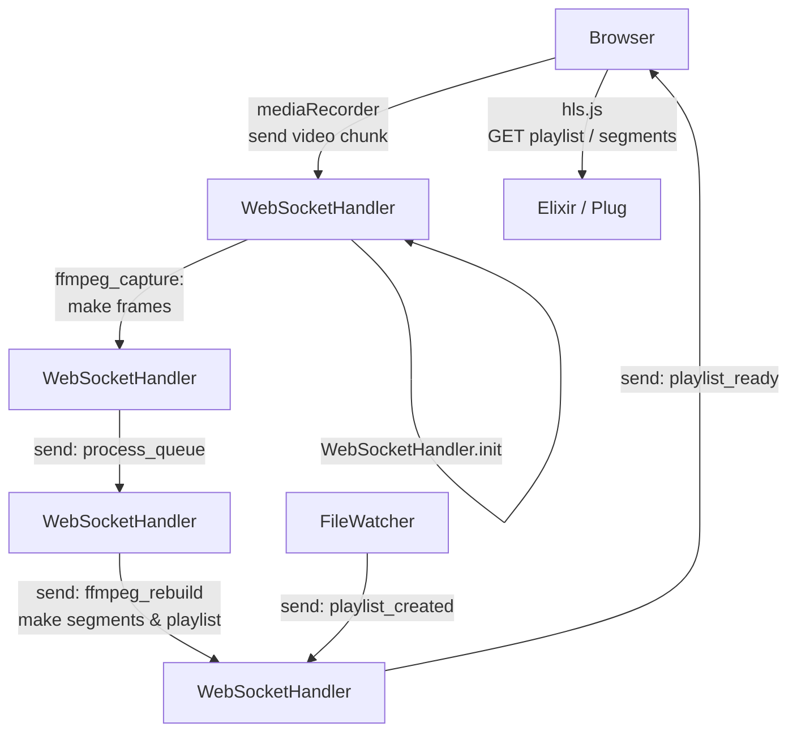
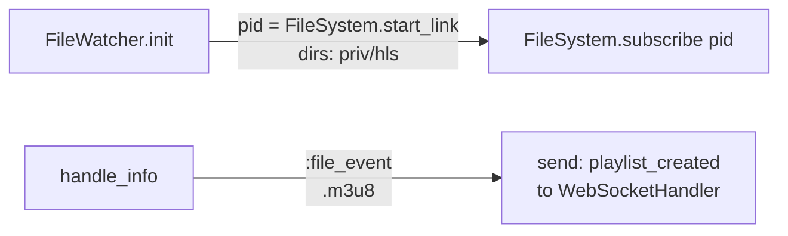
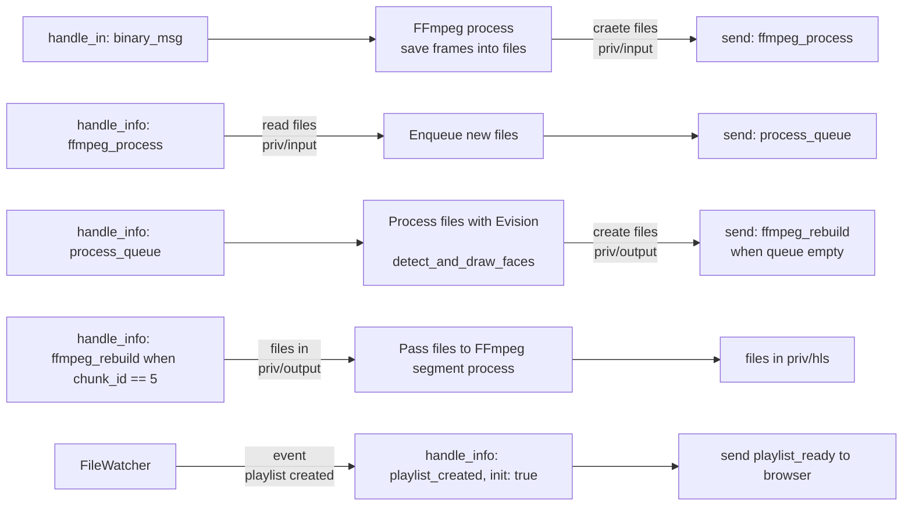
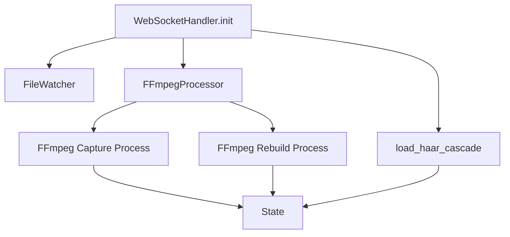

# HTTP Live Streaming (HLS) with Elixir and Livebook and face recognition

## What?

We illustrate [HTTP Live Streaming](https://en.wikipedia.org/wiki/HTTP_Live_Streaming) using - <mark>[hls.js](https://github.com/video-dev/hls.js)</mark>.

Because HLS is based on HTTP, any ordinary web server can originate the stream.

`HLS` is a streaming protocol developed by Apple to deliver media content over the internet using HTTP. It breaks the overall stream into a sequence of small HTTP-based file downloads, each download loading one short chunk of an overall potentially unbounded transport stream. It uses a (unique) "playlist" file that describes the "segments" files to be played. It uses a dedicated library Once these files are available for reading (in the browser), the library <mark>`hls.js`</mark> will download the playlist and consequently segments to be played. It handles entirely the playback process. `Elixir` will serve these files.

:exclamation: This protocole has **high latency**: you will experience up to 20 seconds delay.

## How does HLS work?

[Cloudfare source](https://www.cloudflare.com/learning/video/what-is-http-live-streaming/)

**Server**: An HLS stream originates from a server where (in on-demand streaming) the media file is stored, or where (in live streaming) the stream is created. Because HLS is based on HTTP, any ordinary web server can originate the stream.

Two main processes take place on the server:

- Encoding: The video data is reformatted so that any device can recognize and interpret the data. HLS must use H.264 or H.265 encoding.
- Segmenting: The video is divided up into segments a few seconds in length. The length of the segments can vary, although the default length is 6 seconds (until 2016 it was 10 seconds).

## What are we doing?

Our job here is to:

- capture the built-in webcam stream
- **transform** the images server-side. We ran the "hello world" of computer vision, namely **face detection** with the `Haar Cascade model`. This is powered by [Evision](https://github.com/cocoa-xu/evision) (<mark>[OpenCV](https://docs.opencv.org/4.10.0/)</mark>). The model is present by default in the source code of `Evision` and has a loader for it.
- send the transformed images back to the browser. They are played back by the Javacript library `hls.js`. It is based on the [MediaSource API](https://developer.mozilla.org/en-US/docs/Web/API/MediaSource).

This relies heavily on <mark>[FFmpeg](https://ffmpeg.org/ffmpeg-formats.html#hls-1)</mark> to get frames from the input video source and build HLS segments and the playlist.

## How?

We propose two versions: a `Livebook` and an `Elixir/Plug` app.

Why? The Livebook is an easy and self contained app but the code is slighlty different from the web app from whom you may borrow the code.

:exclamation: We need to have `FFmpeg` installed but also `fsevent` on MacOS or `inotify` for Linux on which depends `FlieSystem`.

:exclamation: You might encounter sometimes the error "segmentation fault". No further explanation on this.

### A livebook

This gives a nice introduction on how to use the amazing `Kino.JS.Live` module.

[](https://livebook.dev/run?url=https%3A%2F%2Fgithub.com%2Fdwyl%2FHLS-demo%2Fblob%2Fmain%2Flib%2Fhls-demo.livemd)

> The default directory to which all the files are saved is your home directory. All the files will be saved in 3 folders: "./priv/input", "./priv/output" and "./priv/hls". **You need to clean these folders**.

### A web app

To run the web app, you fork the repo:

```elixir
open http://localhost:4000 && mix run --no-halt
```

The web app is minimal in the sense that it is is a `Plug` app. 

We run a tpc listener on port 4000 with `Bandit` to communicate with the browser.

We use a _raw WebSocket_ in the browser. The backend uses the library [websock_adapter](https://github.com/phoenixframework/websock_adapter).
We use it to send binary data (an `ArryBuffer`) from the browser to the Elixir backend. Check [this blog](https://kobrakai.de/kolumne/bare-websockets).
We securized the WS connection with a CSRFToken.

We have a `Plug` router that:

- serves the static files: the (unique) HTML page, the associated Javascript module and the HLS files,
- handles the `WebSocket` connection.

We run `FFmpeg` as **"kept alive"** with `ExCmd.Process`. This is crucial for the process.

We run a **file watcher process** with `file_system`. It will detect when `FFmpeg` will have built the HLS playlist and segments.

## Telemetry

The process is able to handle "small" frames (640x480) at 30 fps. We use approx 300 I/O per second.
The memory seems stable around 70MB during a 20 min test.


## Process flow

The browser will ask to control your webcam.

Once you click on "start", a WebSocket connection is instantiated with the backend.
The browser will produce video chunks and send them to the server.
The server will extract all the frames, save them into files, pass the file to the Evision process for face detection.
The frames will be glued altogether (respecting the order) to produce video chunks ready for the browser to consume them.
They is a file watching process to detect when the playlist is ready, and we pass this message to the browser.
The HLS Javascript library will then ready the playlist and download on a regular basis the new segments it needs.



### Notes on the code

#### The "web router" module

We defined four routes.

The root "/" sends the HTML text. It is parsed to add a CSRFToken.

The "/js/main.js" route sends the Javascript file when the browser calls it.

The ""/hls/:file" route sends the HLS segments when the browser calls them.

The "/socket" route upgrade to a WebSocket connection after the token validation (comparison between the token saved in the session and the one received in the query string).

#### The "controller" module

This module serves the files. Since we want to pass a "CSRFToken" to the Javascript, we use `EEX.eval_file` to parse the "index.html.heex" text.

```elixir
def serve_homepage(conn, %{csrf_token: token}) do
html = EEx.eval_file("./priv/index.html.heex", csrf_token: token)
Plug.Conn.send_resp(conn, 200, html)
end
```

#### The "file watcher" module

It essentially uses `FileSystem`. We declare which folder we want to monitor. Whenever a change in the file system occurs in this folder, an event is emitted. We exploit it to send to the caller process (the WebSocketHandler) a message.
More precisely, we monitor the creation of the "playlist.m3u8" file.



#### The "ffmpeg processor" module

It runs `FFmpeg` as "keep alive" processes via `ExCmd`. This is crucial as we pipe the stdin to FFmpeg.

When we receive video chunks in binary form via the WebSocket (approx 300KB, depending on the height/width of your video HTMLElement), we pass it to FFmpeg to extract all the frames, at 30 fps.
Each frame is saved into a file (approx 10kB).

The other FFmpeg process is when we rebuild HLS video chunks from the transformed frames.
FFmpeg will update a playlist and produce HLS segments. The FFmpeg process must not die in order not to append "#EXT-X-ENDLIST" at the end of the playlist.

The general form of a FFmpeg command is:

```
ffmpeg [GeneralOptions] [InputFileOptions] -i input [OutputFileOptions] output
```

#### The "image processor" module

We use `Evision` to detect faces and draw rectangles around the region of interest found.

:exclamation: When you run the code, you will see that the Haar Cascade models produces a lot of false positives.

#### The "websocket handler" module

A visualisation may perhaps help to understand.



##### Instantiate the WebSocket handler

When the browser initiates a WebSocket connection, the backend will respond with:



### Javascript

For clarity, the Javascript module is separated into its own file. It is served by Elixir/Plug.

We load `hls.js` from a CDN:

```html
<script src="https://cdn.jsdelivr.net/npm/hls.js@latest" defer></script>
```

We need to use `DOMContentLoaded`, so the "main.js" module starts with:

```js
window.addEventListener('DOMContentLoaded', ()=> {...})
```

We use the WebSocket API:

```js
let socket = new WebSocket(
  `ws://localhost:4000/socket?csrf_token=${csrfToken}`
);
```

We use the WebRTC API method `getUserMedia` to display the built-in into a `<video>` element:

```js
let stream = await navigator.mediaDevices.getUserMedia({
  video: { width: 640, height: 480 },
  audio: false,
});

video1.srcObject = stream;
```

We use the `MediaRecorder` API to record the streams and push chunks every 1000ms to the connected server via the WebSocket:

```js
let mediaRecorder = new MediaRecorder(stream);

mediaRecorder.ondataavailable = async ({ data }) => {
  if (!isReady) return;
  if (data.size > 0) {
    console.log(data.size);
    const buffer = await data.arrayBuffer();
    if (socket.readyState === WebSocket.OPEN) {
      socket.send(buffer);
    }
  }
};
mediaRecorder.start(1_000);
```
